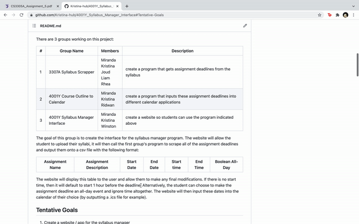

# 4001Y_Syllabus_Manager_Interface

## Table of Contents
- [About](#About)
- [Tentative Goals](#Tentative-Goals)
- [Anticipated Impact](#Anticipated-Impact)
- [Possible Action Plan](#Possible-Action-Plan)
- [Steps](#Steps)
- [Deliverables](#Deliverables)
- [Installation](#Installation)
- [Kristina](#Kristina)
- [Miranda](#Miranda)
- [Winston](#Winston)
- [Demo](#Demo)
- [Git Reference](#Git-Reference)
- [AWS Reference](#AWS-Reference)

## About
Miranda and I were discussing how much time it takes for both of us to read through our course outlines and manually add assignment deadlines one by one into our calendars. We want to make a program that automates this process for us. <br/><br/>
There are 3 groups working on this project:

| # | Group Name                       | Members                                                 |  Description                                                             |
| - | -------------------------------- | ------------------------------------------------------- | ------------------------------------------------------------------------ |
| 1 | 3307A Syllabus Scrapper          | Miranda <br/> Kristina <br/> Joud <br/> Liam <br/> Rhea | create a program that gets assignment deadlines from the syllabus        |
| 2 | 4001Y Course Outline to Calendar | Miranda <br/> Kristina <br/> Ridwan | create a program that inputs these assignment deadlines into different calendar applications |
| 3 | 4001Y Syllabus Manager Interface | Miranda <br/> Kristina <br/> Winston | create a website so students can use the program indicated above                            |

The goal of this group is to create the interface for the syllabus manager program. 
The website will allow the student to upload their syllabi, it will then call the first group's program to scrape all of the assignment deadlines and output them onto a csv file with the following format:

| Assignment Name | Assignment Description | Start Date | End Date | Start time | End Time | Boolean All-Day |
| --------------- | ---------------------- | ---------- | -------- | ---------- | -------- | --------------- |

The website will display this table to the user and allow them to make any final modifications. If there is no start time, then it will default to start 1 hour before the deadline. 
Alternatively, the student can choose to make the assignment deadline an all-day event and ignore time altogether. The website will then input these dates into the calendar of their choice (by outputting a .ics file for example). 

## Tentative Goals
1. Create a website / app for the syllabus manager
2. Get students to test and rate initial versions
3. Advertise the final product

## Anticipated Impact
By making it easier for students to put deadlines from their syllabus into their calendars, we hope to incentivize better time management.
<br/><br/>
As a first year student, keeping track of upcoming deadlines is crucial to staying on top of one's work. Time Management is especially important as a first year student in Integrated Science while making the transition from High School to University courses. Figuring out how to stay organized will make a huge difference in their performance but often times, students will not take the time to thoroughly read through their syllabus and make a list of all of their assignment deadlines because of how long and tedious the process is. 
<br/><br/>
The anticipated impact of this project is to encourage students to keep track of their deadlines by using this website to extract assignment due dates from their syllabus and automatically input them into their calendar. Using this website will save them hours of time and it will also encourage them to use a calendar application. The amount of time it takes to manually input the deadlines into a calendar is often a deterrent so using this website will hopefully persuade more WiSc students to use an organization tool to keep track of their upcoming deadlines. 

## Possible Action Plan
Miranda and I are taking the same project course CS3307 where we have teamed up with 3 other computer science majors to code a C++ program capable of scanning course outlines and outputting assignment deadlines to a csv file. 
<br/><br/>
In this class, I will lead a group to create a website interface for the Syllabus Manager so that Western students can use it. 
Members of my group that do not want to code will be in charge of testing and advertising. The tester will get hundreds of students on Western Campus to test our software and rate their experience. 
The advertiser will make sure Integrated Science students as well as other Western students know about this website, they will come up with a plan to make this widely known and widely used.

## Steps
1.	Use Slack for communication and meet once a week every Wednesday at 2:30pm over Zoom
2.	Create a UML diagram to plan out all of the classes and organization of the code
3.	Draw a picture of what we would like the website to look like
4.	Use Python and GitHub to create the website locally
5.	Use AWS to host the website externally
6.	Presentation of the website during an in-person visit of the 1001X class
7.	Ask WiSc students for feedback on how to change the website
8.	Ask Felix to send an e-mail to all WiSc Students with the link to the website 
9.	Post link to WiSc Facebook group chat
10.	Post link to the private Facebook group called Western Integrated Science
11.	Post link to the public Facebook group called " "Must Knows" for courses at UWO
12.	Post link to LinkedIn to reach a wider audience

## Deliverables
1.	UML diagram 
2.	Picture of what we would like the website to look like
3.	A working website
4.	In-person presentation to the 1001X class

## Installation
```shell script
$ pip3 install -r requirements.txt
```

## Kristina
  - Worked on the UML diagram
  - Helped create a picture of what we would like the website to look like
  - Created a Github Repository and helped get all group members connected to GitHub
  - Deployed the initial website to AWS using Flask
  
## Miranda
  - Worked on the UML diagram
  - Helped create a picture of what we would like the website to look like
    
## Winston
  - Worked on the UML diagram
  - Helped create a picture of what we would like the website to look like
  
## Demo
Created using: https://ezgif.com/maker<br/><br/>
  

## Git Reference

#### Setting up Git Repo
Tutorial: https://docs.github.com/en/enterprise-server@3.0/authentication/connecting-to-github-with-ssh/adding-a-new-ssh-key-to-your-github-account <br/><br/>
Add to your config file:
```shell script
$ touch ~/.ssh/config
$ open ~/.ssh/config

Host *
  AddKeysToAgent yes
  UseKeychain yes
  IdentityFile ~/.ssh/id_ed25519
```
Create an ssh key:
```shell script
$ ssh-keygen -t ed25519 -C "email@gmail.com"
$ ssh-add -K ~/.ssh/id_ed25519
$ pbcopy < ~/.ssh/id_ed25519.pub
```
Go to GitHub -> Settings -> SSH and GPG keys -> New SSH key <br/>
Paste the public key copied to your clipboard
```shell script
$ git clone git@github.com:Kristina-hub/4001Y_Syllabus_Manager_Interface.git
```

#### Make a txt file
```shell script
$ cd 4001Y_Syllabus_Manager_Interface/
$ ls
$ touch file.txt
$ nano file.txt

CTRL X -> Y -> Enter
```

#### Push to Git Repo
```shell script
$ git pull
$ git add .
$ git commit -m "comment"
$ git push
```
If issues with git pull or git push, save your changes somewhere and:
```shell script
$ git reset --hard origin/main
$ git log -1
```

#### Create a branch
```shell script
$ git branch 
$ git branch branch-name
$ git checkout branch-name
$ git branch
$ touch file2.txt
$ git add .
$ git commit -m "comment"
$ git checkout main
$ git branch
$ git push origin branch-name
```
#### Merge the branch
```shell script
$ git merge branch-name
$ git branch
$ git push origin main
```

## AWS Reference
Tutorial video: https://www.youtube.com/watch?v=4tDjVFbi31o 
```shell script
$ python list
$ python3 -m venv .venv
$ source .venv/bin/activate
$ python list
$ pip3 install --upgrade pip
$ pip3 install flask
$ pip3 freeze > requirements.txt
$ pip3 freeze
$ pip3 install -r requirements.txt
```
Must be called application.py so easily connects to AWS
```shell script
$ touch application.py

from flask import Flask
application = Flask(__name__)
@application.route('/')
def hello_world():
	return 'Hello World'
	
$ export FLASK_APP="application.py"
$ flask run
```
Now runs locally: http://127.0.0.1:5000/
```shell script
$ git init
$ git status
$ touch .gitignore
```
Makes sure not to push anything in repo that do not want to push
```shell script
$ git pull
$ git add .
$ git commit -m "comment"
$ git push
```
AWS -> Services -> Elastic beanstalk <br/>
Create New Application called syllabus-manager using Python <br/>
Create New Environment called syllabus-manager-env using Web Server Environment <br/>

Services -> Developer Tools -> CodePipeline <br/>
Create Pipeline called syllabus-manager <br/>
GitHub version 2 -> Connect to Github <br/>
Connection name is connection -> Install a New App -> Choose repo name -> Skip build stage -> Deploy to AWS Elastic Beanstalk <br/>

This link is no longer local: http://syllabus-manager-env.eba-ukg5xfdy.us-east-1.elasticbeanstalk.com/ <br/>
