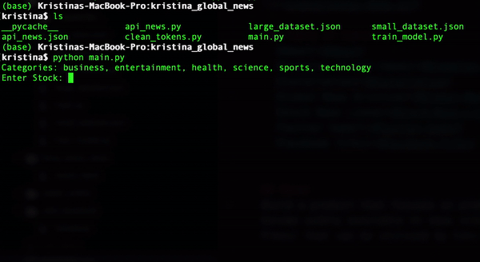

# 4001Y_Syllabus_Manager_Interface

## Table of Contents
- [About](#About)
- [Tentative Goals](#Tentative-Goals)
- [Anticipated Impact](#Anticipated-Impact)
- [Possible Action Plan](#Possible-Action-Plan)
- [Installation](#Installation)
- [Kristina](#Kristina)
- [Miranda](#Miranda)
- [Winston](#Winston)
- [Demo](#Demo)
- [Git Reference](#Git-Reference)
- [AWS Reference](#AWS-Reference)

## About
Miranda and I were discussing how much time it takes for both of us to read through our course outlines and manually add assignment deadlines one by one into our calendars. We want to make a program that automates this process for us.

## Tentative Goals
1. Create a website / app for the syllabus manager
2. Get students to test and rate initial versions
3. Advertise the final product

## Anticipated Impact
By making it easier for students to put deadlines from their syllabus into their calendars, we hope to incentivize better time management.

## Possible Action Plan
Miranda and I are taking the same project course CS3307 where we have teamed up with 3 other computer science majors to code a C++ program capable of scanning course outlines and outputting assignment deadlines to a csv file. <br/><br/>
In this class, I will lead a group to create a website interface for the Syllabus Manager so that Western students can use it. <br/><br/>
Members of my group that do not want to code will be in charge of testing and advertising. The tester will get hundreds of students on Western Campus to test our software and rate their experience. <br/><br/>
The advertiser will make sure Integrated Science students as well as other Western students know about this website, they will come up with a plan to make this widely known and widely used.

## Installation
```shell script
$ pip3 install -r requirements.txt
```

## Kristina
  - Worked on...
  
## Miranda
  - Worked on...
  
## Winston
  - Worked on...
  
## Demo
  

## Git Reference

### Setting up Git Repo
Tutorial: https://docs.github.com/en/enterprise-server@3.0/authentication/connecting-to-github-with-ssh/adding-a-new-ssh-key-to-your-github-account <br/>
Add to your config file:
```shell script
$ touch ~/.ssh/config
$ open ~/.ssh/config

Host *
  AddKeysToAgent yes
  UseKeychain yes
  IdentityFile ~/.ssh/id_ed25519
```
Create an ssh key:
```shell script
$ ssh-keygen -t ed25519 -C "email@gmail.com"
$ ssh-add -K ~/.ssh/id_ed25519
$ pbcopy < ~/.ssh/id_ed25519.pub
```
Go to GitHub -> Settings -> SSH and GPG keys -> New SSH key <br/>
Paste the public key copied to your clipboard
```shell script
$ git clone git@github.com:Kristina-hub/4001Y_Syllabus_Manager_Interface.git
```

### Make a txt file
```shell script
$ cd 4001Y_Syllabus_Manager_Interface/
$ ls
$ touch file.txt
$ nano file.txt
CTRL X -> Y -> Enter
```

### Push to Git Repo
```shell script
$ git pull
$ git add .
$ git commit -m "comment"
$ git push
```
If issues with git pull or git push, save your changes somewhere and:
```shell script
$ git reset --hard origin/main
$ git log -1
```

### Create a branch
```shell script
$ git branch 
$ git branch branch-name
$ git checkout branch-name
$ git branch
$ touch file2.txt
$ git add .
$ git commit -m "comment"
$ git checkout main
$ git branch
$ git push origin branch-name
```
Merge the branch:
```shell script
$ git merge branch-name
$ git branch
$ git push origin main
```

## AWS Reference
Tutorial video: https://www.youtube.com/watch?v=4tDjVFbi31o 
```shell script
$ python list
$ python3 -m venv .venv
$ source .venv/bin/activate
$ python list
$ pip3 install --upgrade pip
$ pip3 install flask
$ pip3 freeze > requirements.txt
$ pip3 freeze
$ pip3 install -r requirements.txt
```
Must be called application.py so easily connects to AWS
```shell script
$ touch application.py

from flask import Flask
application = Flask(__name__)

@application.route('/')
def hello_world():
	return 'Hello World'
	
$ export FLASK_APP="application.py"
$ flask run
```
Now runs locally: http://127.0.0.1:5000/
```shell script
$ git init
$ git status
$ touch .gitignore
```
Makes sure not to push anything in repo that do not want to push
```shell script
$ git pull
$ git add .
$ git commit -m "comment"
$ git push
```
AWS -> Services -> Elastic beanstalk <br/>
Create New Application called syllabus-manager using Python <br/>
Create New Environment called syllabus-manager-env using Web Server Environment <br/>

Services -> Developer Tools -> CodePipeline <br/>
Create Pipeline called syllabus-manager <br/>
GitHub version 2 -> Connect to Github <br/>
Connection name is connection -> Install a New App -> Choose repo name -> Skip build stage -> Deploy to AWS Elastic Beanstalk <br/>

This link is no longer local: http://syllabus-manager-env.eba-ukg5xfdy.us-east-1.elasticbeanstalk.com/ <br/>
